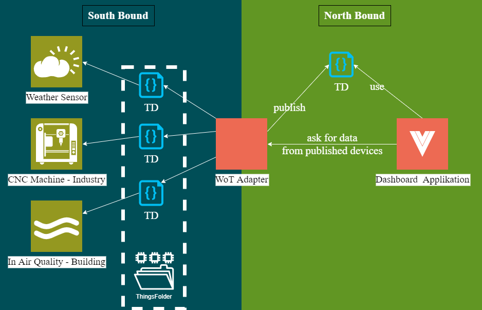
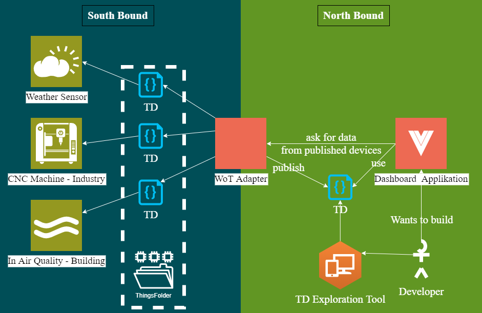
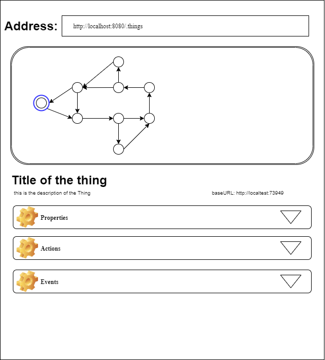
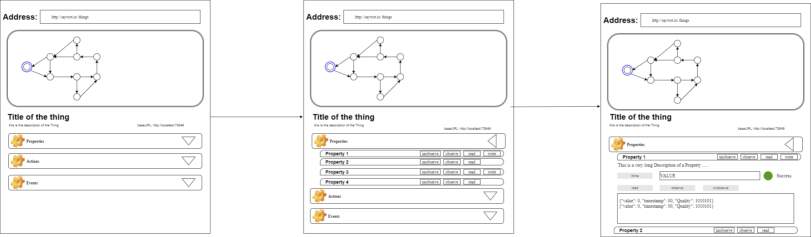
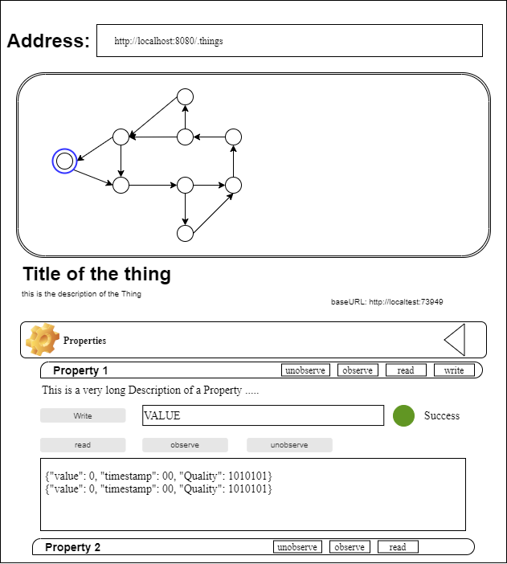

################################
Proposal for TD exploration tool
################################

Introduction
############

In here I will propose a tool for easily getting to know the Thing Descriptions that are accessible by a certain endpoint. 
First let me display the situation at the moment: 

So as you can see we will be looking at the North Bound side of the Adapter. 
The User of this tool will be someone who wants to build an Application on top of an Adapter publishing Thing Descriptions. 
The first step for someone building an Application on top of our Adapter ist to get to know the Things he can access. I will try to draw the intention in a small schema: 

Since this shall be at minimum an Inner Source tool but at best an Open Source Tool, this Document should be a living one. 
In here new features shall be proposed as the development of the tool goes on. In my opinion this a good way of dcoumenting and developing this tool. 

Self contained tool
###########################

Due to the fact that the WoT Standard introduced by W3C can be implemented by anyone, it would be great to implement a tool that just needs it self to work. 
The only thing the tool needs is a place where it can find a TD or a list of TDs. 
I would propose a tool which can be run a browser like swagger ui. 

Features 
########

-------
General
-------

The goal is to describe in this document a tool which makes the Thing Description written in jsonld easier to write for humans. 
I will often compare to Swagger where you describe a REST API with a yaml file which is quiet hard to read for a human, so there is a ui which renders this yaml file into a HTML page that can be displayed within a browser.

There are some differences between the swagger.yaml file and the thingDescription.jsonld file why we need another file specifically for this task. 
The most obvious is that you can link ThingDescriptions. This leads to the fact that you can build Graph or Tree like structures of linked ThingDescriptions.

Another one is that there are not only 1 kind of actions you can interact with the "other side" (in case of swagger that is REST) 

A Thing Description contains three sections: 
* Properties 
* Actions
* Events

I propose that the tool display each of these sections as a collapsible section, so the user does not get lost. We will go into detail in the next cahpters. 

Sketch can be seen here: 

-----
Links
-----

I propose that our tool has a section where it displays as graph or tree the structure of the Thing Descriptions. 
e.g.: if you have a shop floor where the different stations have each their own Thing Descriptions they can be linked in the order like they are in the plant. 
In that usecase the links in the Thing Descriptions can also contain the structure of the shop floor and how different sensors or machines are connected in the production workflow. 

I would also propose that the nodes in the Graph are clickable so that you can display the corresponding Thing Description.

----------
Properties
----------

I propose that in this collapsible section all properties will be listed. 
Every Property should get its own collapsible tile where the details for this property will display as shown in the next chapter in this document. 
Still every property has some fields that should be shown for each. These are the name, description and the type. 

Here you can see the flow of how to expand one property: 

Also each property can have four different operations (writeproperty, readproperty, observeproperty, unobserveproperty), I propose to display these as labels next to the name of the property. 

show Properties
---------------

In this section of the tool a list of all properties of the thing will be displayed. It should be also visible if a property is readable, writeable, observable or unobservable. 
I propose to show this by adding labels next to the property. 

.. image:: ../images/WoT_exploration_Properties.png
    :width: 400

read Properties
---------------

One property should be readable from the tool, if that is possible by the protocol that is in the Thing Description. 
The result should be displayed next to the read button. Maybe in some kind of console-like window. You can see an example in the sketch.

write Properties
----------------

If the Property is writeable, there should be a textfield where the user can enter a value he wants to write. 
The field could give a hint on the type the Thing is accepting. After entering a value a button can be pressed to send the value. 
The result should be visible next to the field, maybe something like a green light for success and so on. 

observe Property
----------------

If the property is observable there should be a button to do so. 
it could be like shown in the sketch next to the read button and the values that are observed ill be writtn into the mentioned console like window. 
Same goes for unobserving a property. 

-------
Actions
-------

run Actions
-----------

when you expand an Action there should be the possibility to run that action. Something like a button would be preffered 

------
Events
------

subscribe to Event
------------------

This should work the same like observing a property. 
